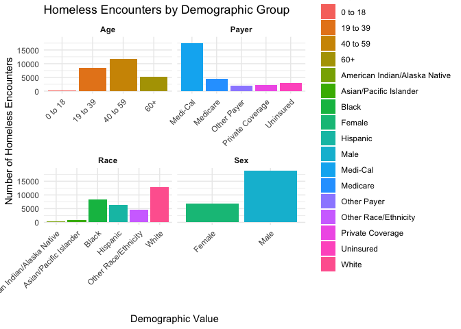
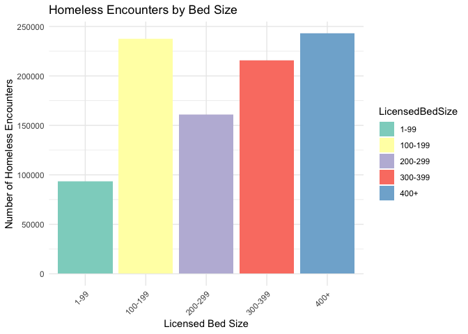
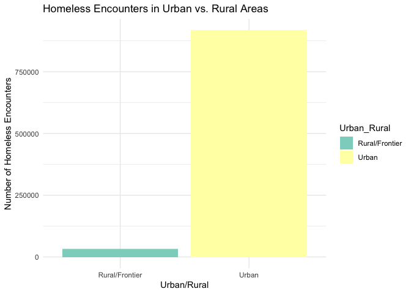
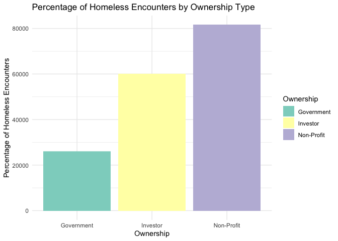

eda of 20192020 homeless
================
Jiatong Li
2023-11-18

``` r
library(tidyverse)
library(knitr)
homeless_ip<-read.csv("2019-2020-homeless-ip-and-ed-by-facility.csv")
homeless_data<-homeless_ip %>% 
  filter(HomelessIndicator == "Homeless")
```

#### Description of important variables

`2019-2020-homeless-ip-and-ed-by-facility` contains 17 variables, some
of which are listed below:

`Licensed Bed Size`: the hospital’s number of licensed beds.  
`Homeless Indicator`: indicates if the data is for Homeless or
Non-Homeless encounters.  
`Demographic Category`: Age, Race, Sex, or (Expected) Payer.  
`Encounters`: Count of inpatient hospitalizations (i.e., discharges) or
emergency department visits.  
`Total Hospital Encounters`: Total inpatient hospitalizations or
emergency department visits per hospital.

#### Correlation Matrix of Homeless Data

``` r
# Correlation matrix
numeric_data <- homeless_data %>% dplyr::select(Encounters, TotalEncounters, Percent)
correlation_matrix <- cor(numeric_data, method = "pearson")
correlation_table <- kable(correlation_matrix, caption = "Correlation Matrix of Homeless Data")
correlation_table
```

|                 | Encounters | TotalEncounters |    Percent |
|:----------------|-----------:|----------------:|-----------:|
| Encounters      |  1.0000000 |       0.6696037 |  0.3308220 |
| TotalEncounters |  0.6696037 |       1.0000000 | -0.0000295 |
| Percent         |  0.3308220 |      -0.0000295 |  1.0000000 |

Correlation Matrix of Homeless Data

**Encounters and TotalEncounters**: There is a moderate positive
correlation of approximately 0.67. This suggests that as the total
number of encounters at a facility increases, the number of homeless
encounters also tends to increase. This could be expected as larger
facilities might see more patients overall, including homeless
individuals.

#### Homeless Encounters by Demographic Group (Age, Payer, Race, Sex)

``` r
homeless_ip<-read.csv("2019-2020-homeless-ip-and-ed-by-facility.csv")

homeless_data<-homeless_ip %>% 
  filter(HomelessIndicator == "Homeless")
combined_plot <- homeless_data %>%
  ggplot(aes(x = DemographicValue, y = Encounters, fill = DemographicValue)) +
  geom_bar(stat = "identity", position = "dodge") +
  facet_wrap(~ Demographic, scales = "free_x") + 
  labs(title = "Homeless Encounters by Demographic Group",
       x = "Demographic Value",
       y = "Number of Homeless Encounters") +
  theme_minimal() +
  theme(axis.text.x = element_text(angle = 45, hjust = 1),
        strip.text.x = element_text(face = "bold")) 
combined_plot
```

<!-- -->

This analysis provides a breakdown of homeless encounters by different
demographic facets and indicates which groups have higher or lower
counts of encounters. It suggests that middle-aged individuals, those
covered by Medi-Cal, white individuals, and males have higher numbers of
homeless encounters. These findings could point towards specific
demographic groups that may require more focused services and
interventions.

#### Homeless Encounters by Bed Size

``` r
plot2<-homeless_ip %>%
  filter(HomelessIndicator == "Homeless" & EncounterType == "Inpatient Hospitalizations") %>%
  ggplot(aes(x = LicensedBedSize, y = Encounters, fill = LicensedBedSize)) +
  geom_bar(stat = "identity") +
  scale_fill_brewer(palette = "Set3") +
  labs(title = "Homeless Encounters by Bed Size",
       x = "Licensed Bed Size",
       y = "Number of Homeless Encounters") +
  theme_minimal() +
  theme(axis.text.x = element_text(angle = 45, hjust = 1))
plot2
```

<!-- -->

Among the variable Bed Size, the category of 400+ Licensed Bed Size
shows a high number of encounters of homelessness as compared to other
groups, indicating that larger hospitals may have a higher number of
such encounters. This could be due to a larger capacity to serve more
patients or a higher likelihood of being located in urban areas where
homelessness rates may be higher. The second leading category is the
100-199 Licensed Bed Size which was relatively high, because hospitals
with 100-199 beds might be specialized in services that are more
frequently utilized by the homeless population, such as mental health or
substance abuse treatment and these medium-sized hospitals could be
strategically located in areas where the homeless population is higher.

#### Homeless Encounters by Area

``` r
plot3<-homeless_data %>%
  filter(HomelessIndicator == "Homeless" & EncounterType == "Inpatient Hospitalizations") %>%
  ggplot(aes(x = Urban_Rural, y = Encounters, fill = Urban_Rural)) +
  geom_bar(stat = "identity") +
  scale_fill_brewer(palette = "Set3") +
  labs(title = "Homeless Encounters in Urban vs. Rural Areas",
       x = "Urban/Rural",
       y = "Number of Homeless Encounters") +
  theme_minimal()
plot3
```

<!-- -->

This plot help us gain the understanding of the relationship between the
number of homelessness encounters and rural/ urban settlement. It is
evident that in urban areas there are many people who tend to be
homeless due to various reasons such as poverty. Urban hospitals are
often larger and have more comprehensive services, which might also
contribute to the higher number of encounters. On the other hand, in
rural areas less people tend to be homeless since life there is cheap
and easily affordable. The more the population in a certain place the
higher the chances of homelessness encounters.

#### Homeless Encounters by Ownership Type

``` r
plot4<-homeless_ip %>%
  filter(HomelessIndicator == "Homeless" & EncounterType == "Inpatient Hospitalizations") %>%
  ggplot(aes(x = Ownership, y = Percent, fill = Ownership)) +
  geom_bar(stat = "identity") +
  scale_fill_brewer(palette = "Set3") +
  labs(title = "Percentage of Homeless Encounters by Ownership Type",
       x = "Ownership",
       y = "Percentage of Homeless Encounters") +
  theme_minimal()
plot4
```

<!-- -->

When comparing the percentage of homeless encounters by ownership the
non-profit category showed the highest percentage in homeless
encounters. Non-Profit hospitals may have more encounters with homeless
individuals possibly due to their mission-driven approach, which may
include providing care to underserved populations. Investor-owned
hospitals, while having a higher percentage of encounters than
government hospitals, may still be less than Non-Profit hospitals,
potentially due to different operational goals and priorities.
Government-owned hospitals having the lowest percentage could be a
result of factors such as location, size, the scope of services offered,
or specific governmental policies and funding for homeless services.
